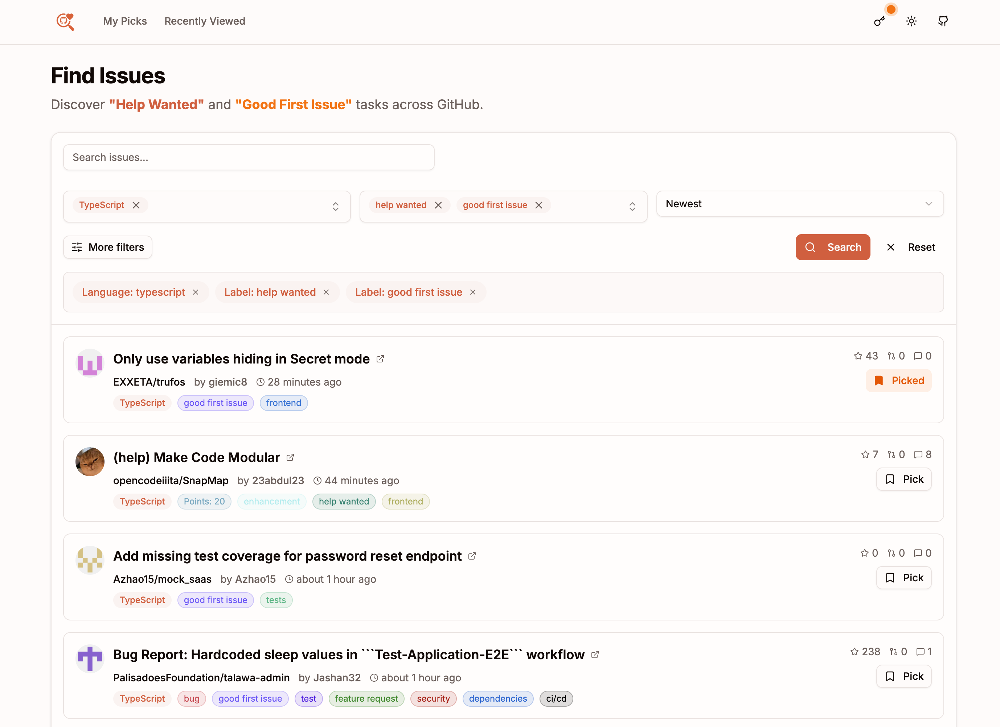

<div align="center">
  
  <h1>Contrib.FYI</h1>
    Find your next open source contribution on GitHub with ease.
  <br><br>
  
  
  
</div>

<div align="center">
  <h3>
    <a href="https://contrib-fyi.github.io/contrib-fyi/">Visit the Web App</a>
  </h3>
  <a href="https://contrib-fyi.github.io/contrib-fyi/">
    
  </a>
</div>

## Why Contrib.FYI?

There are many "Good First Issue" finders available today, but most rely on static lists of curated, popular repositories.

I previously relied on [github-help-wanted](https://github.com/mac-s-g/github-help-wanted/), a fantastic tool that enabled dynamic searching of active issues across GitHub using custom queries.

Contrib.FYI was built to carry forward that powerful **"Dynamic Search"** philosophy. It combines real-time GitHub API access with a modern interface, local issue tracking, and personal token integration to bypass rate limits—creating a robust discovery tool for today's open source contributors.

### Comparison

| Feature             | Contrib.FYI                       | Other Curated Sites           |
| :------------------ | :-------------------------------- | :---------------------------- |
| **Search Strategy** | Dynamic Search (Live GitHub Data) | Static Curation (Manual/Cron) |
| **Niche Languages** | Any Language                      | Major ones only               |
| **Repo Discovery**  | Find hidden gems                  | Famous repos only             |
| **Rate Limit**      | High (Bring your own Token)       | Often limited                 |
| **My Picks (Save)** | Local Storage                     | Rarely supported              |

## Key Features

### 🔍 Advanced Dynamic Search

Directly leverages the GitHub API to provide real-time information. Unlike curated lists, you find what is actually happening right now.

### 🏷 Flexible Filtering

Freely combine filters for programming languages, labels (e.g., "help wanted", "good first issue"), and exclude keywords to refine your search.

### 🔐 Privacy First & High Rate Limits

You can configure your own GitHub Personal Access Token (PAT) to increase API rate limits from 60 to 5,000 requests per hour.
**Privacy First:** Your token is stored strictly in your browser's `localStorage` and is never sent to any external server.

### 🔖 My Picks

Save interesting issues to your local "My Picks" list to review and tackle later.

---

## Development

If you want to run this project locally or contribute to its development, follow the steps below.

### Prerequisites

- Node.js 18+ or compatible package manager
- (Optional) GitHub Personal Access Token for higher rate limits

### Installation

1. Clone the repository:

```bash
git clone https://github.com/yourusername/contrib-fyi.git
cd contrib-fyi/web
```

2. Install dependencies:

```bash
npm install
```

3. (Optional) Configure environment variables:

```bash
cp .env.local.example .env.local
# NEXT_PUBLIC_BASE_PATH=/your/base/path
# NEXT_OUTPUT_MODE=export
# NEXT_PUBLIC_GITHUB_TOKEN=ghp_xxxxxxxxxxxx
```

4. Start the development server:

```bash
npm run dev
```

5. Open [http://localhost:3000](http://localhost:3000) in your browser

### Available Scripts

- `npm run dev` – start the development server
- `npm run build` – create a production build
- `npm run start` – serve the production build
- `npm run lint` – run ESLint
- `npm run format` – format with Prettier
- `npm run typecheck` – run TypeScript without emitting files

## Contributing

Contributions are welcome! Please feel free to submit a Pull Request.

## License

This project is open source and available under the MIT License.
